# GitHub codespaces　を使って　hakoniwa-core-cpp-clientを試す

## はじめに

### GitHub Codespacesとは

GitHub Codespacesは、クライドでホストされている開発環境です。ブラウザ上で動作する Visual Studio Codeと同等の機能を提供し、どこからでもアクセス可能です。
また、開発環境がクラウド上にホストされているため、ローカルPCのリソースに依存せず、高性能な環境で開発できます。
GitHubのアカウントを持っていれば無料で利用が始められます。

> [!NOTE]
> GitHub Codespaces は無料で始められますが、月当たりの利用時間やストレージ容量で有償になります。
>
> 詳しくは次の情報をご覧ください。
> - GitHub Codespaces の請求について
>     - https://docs.github.com/ja/billing/managing-billing-for-github-codespaces/about-billing-for-github-codespaces
> - GitHub Codespaces の使用状況の表示
>     - https://docs.github.com/ja/billing/managing-billing-for-github-codespaces/viewing-your-github-codespaces-usage

本ドキュメントではhakoniwa-core-cpp-clientのサンプルをブラウザを使って実際に動かしてみます。

### 利用にあたっての準備

GitHub Codespacesを使う場合には次を準備する必要があります。
- GitHubアカウント
- github.com へ接続できるネットワーク環境
- ブラウザ

## GitHub Codespaces を起動する

以下、すべてブラウザを起動して操作します。

### Codespace　の起動

1. [toppers/hakoniwa-core-cpp-client](https://github.com/toppers/hakoniwa-core-cpp-client) リポジトリに移動します。
1. [Code]を押下し、[Codespaces]タブを選択します。
1. [Create codespace on main]を選択します。

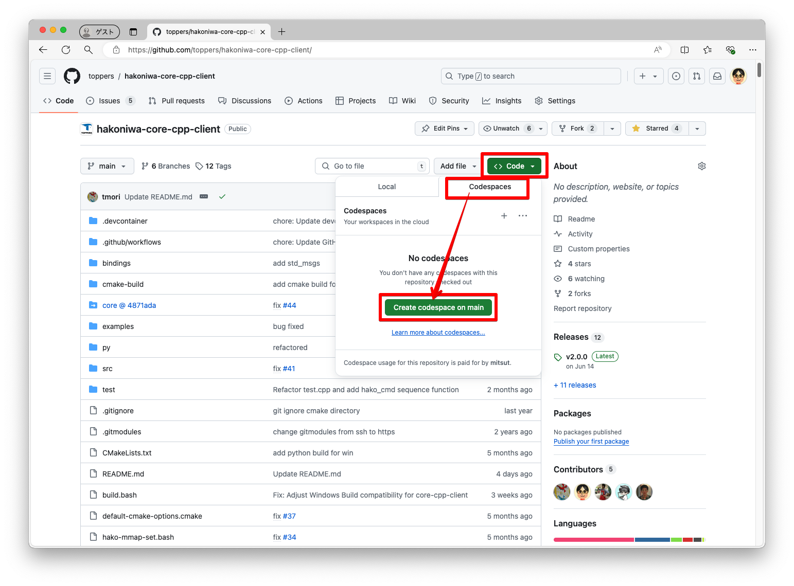

Codespaceの起動が完了すると、リポジトリのワークスペースが起動されます。

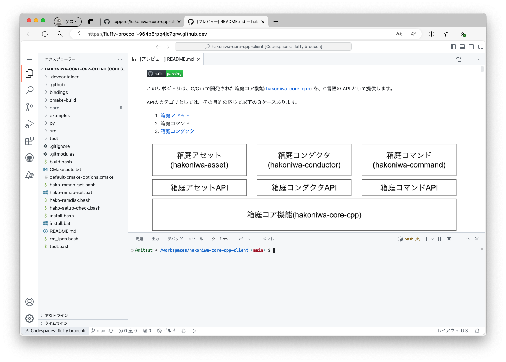

### hakoniwa-core-cpp-clientのインストール手順

READMEのインストール手順に従って、リポジトリのビルドとインストールを行います。

Codespaceでキーボードを使ったコピペを行う場合に、次のような表示がされることがありますが、`許可`を押してください。

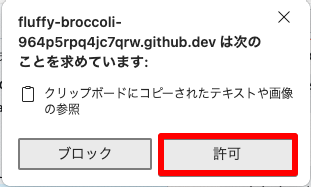

ターミナルで以下のコマンドを実行します。

1. ビルド
```
bash build.bash
```
2. インストール
```
bash install.bash
```
インストールが成功しているかは、以下のコマンドでチェックできます。
```
bash hako-setup-check.bash
```

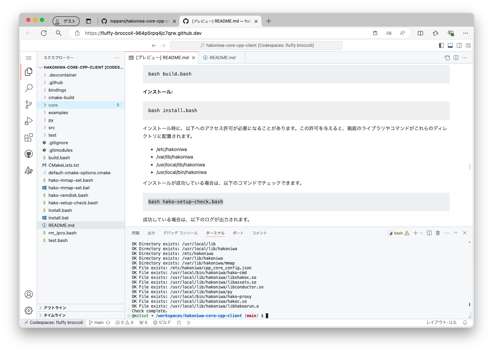

3. 環境変数の設定
~/.bashrc ファイルに以下の行を追加してください。
ターミナルからファイルを開きます
```
code ~/.bashrc
```
```
export LD_LIBRARY_PATH=/usr/local/lib/hakoniwa:$LD_LIBRARY_PATH
export PATH=/usr/local/bin/hakoniwa:$PATH
```
ファイルを閉じた後に変更を反映させます。
```
source ~/.bashrc
```

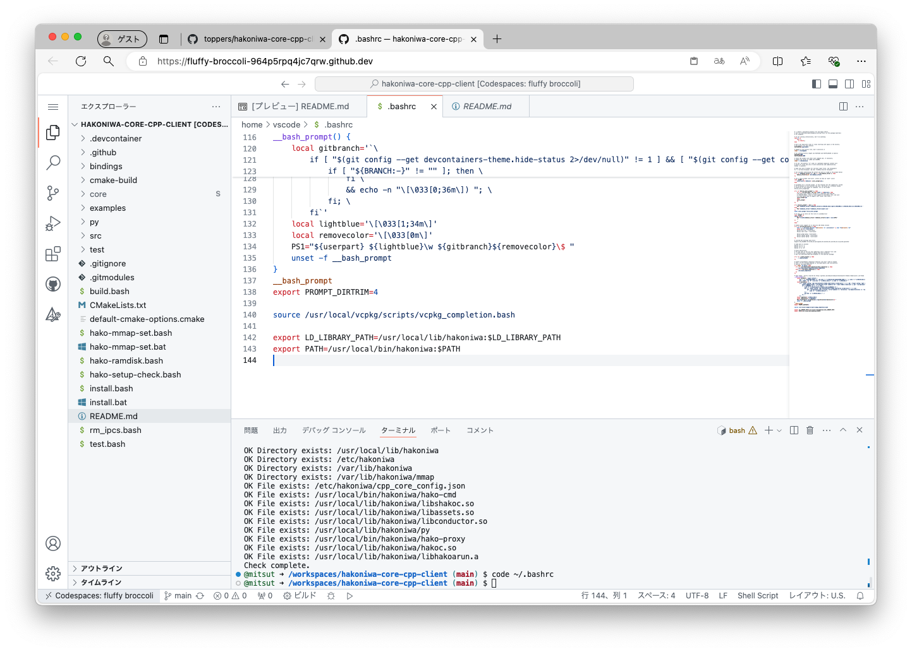


### Hello World　サンプル
Hello Worldではターミナル(端末)を2つ使用します。
端末Aは箱庭アセットを実行します。端末Bは箱庭コマンドで箱庭アセットを起動します。

1. 端末Aでの手順
```
./cmake-build/examples/hello_world/hello_world HelloWorld ./examples/hello_world/custom.json 100
```
2. 端末Bでの手順
端末を起動します。`ターミナルの分割` ボタンを押して、ターミナルを2つに分けます。

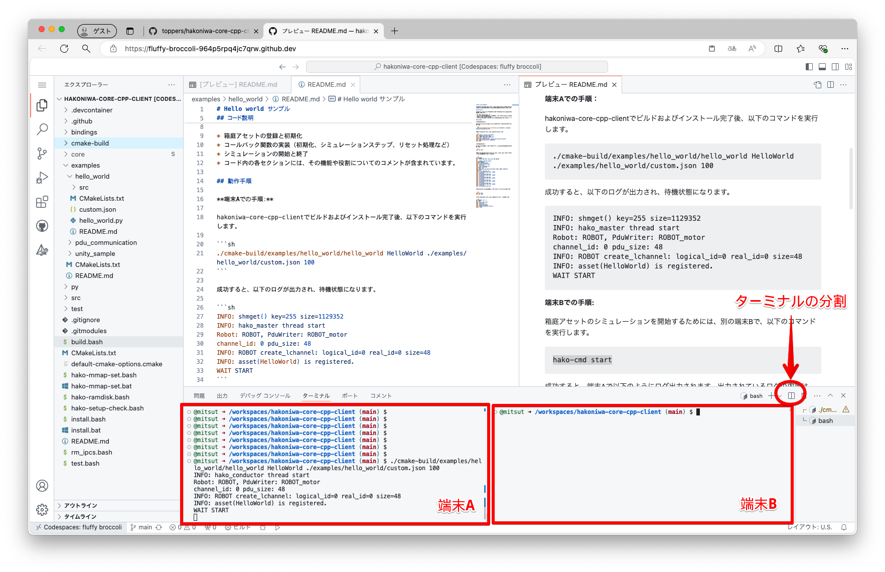

* シミュレーションの開始
```
hako-cmd start
```
Hello Worldが起動します

* シミュレーションの停止、リセット
```
hako-cmd stop
hako-cmd reset
```

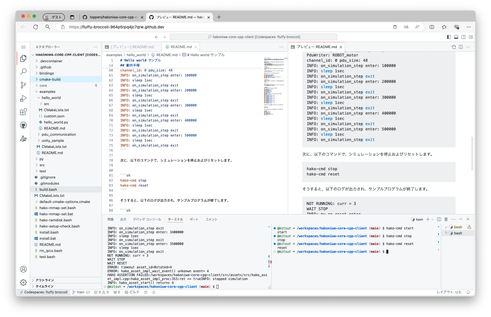

### Codespacesの停止、インスタンスの再起動と削除
ウィンドウの左下をクリックし、`Stop Currenet Codespace` をクリックします。

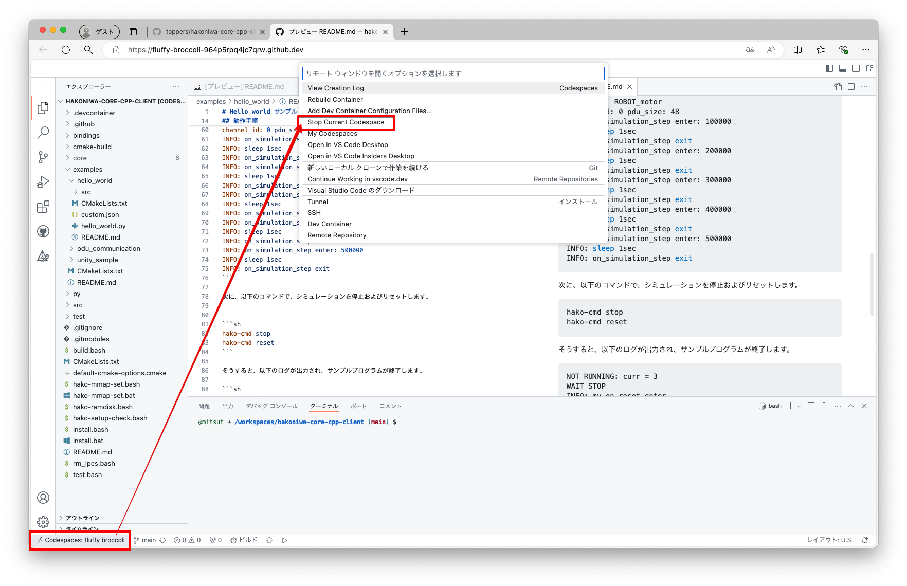

`Codespace is stopped` と表示されれば、停止されました。

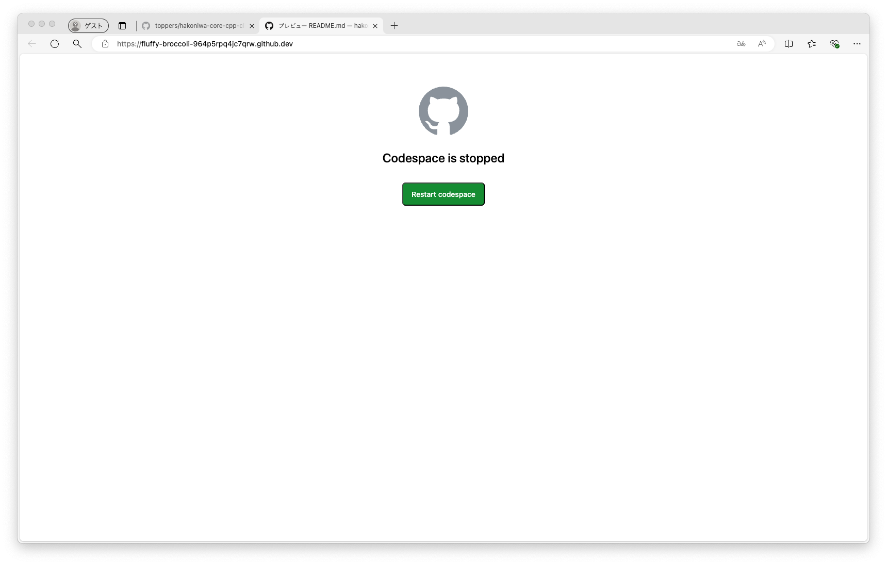

また停止後、インスタンスイメージは残っています。リポジトリのページに戻って、[Code]をクリックすると、さきどの使用していたインスタンスイメージを起動することができます。

また[Delete]をクリックすることでインスタンスイメージは削除されます。
デフォルトでも非アクティブな状態が30日をすぎると自動的に削除されます。


## VSCode DevContainerで起動する
GitHub Codespacesでは、イメージはGitHub側にあります。
GitHub側でのマシンスペックは変更することはできますが、無料による使用範囲は限定されています。
ローカルPCにVSCodeとDocker環境をインストールしておくことで、コンテナ環境で動作することも可能です。

### 必要な環境のインストール
* VSCode

すでにインストール済みで進めます

* Docker

Docker Desktop をインストールしてください。
もしくはWindowsの場合は WSL2にUbuntuをインストールし、Ubuntu内でDockerをインストールされている場合でもOKです。

* Dev Containers

[Dev Concatainers](https://marketplace.visualstudio.com/items?itemName=ms-vscode-remote.remote-containers)をVSCodeの拡張機能としてインストールします。

### リポジトリのクローンとVSCodeの起動

1. リポジトリのクローン
```
git clone --recursive https://github.com/toppers/hakoniwa-core-cpp-client.git
```

2. VSCodeの起動
```
code hakoniwa-core-cpp-client
```

3. コンテナで再度開く

フォルダーに開発コンテナの構成ファイルが含まれていますというメッセージが表示されている場合は、`コンテナで再度開く` をクリックします。

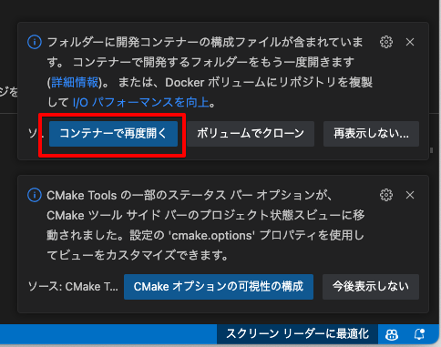

表示されていない場合は、ウィンドウの左下から `コンテナで再度開く` のメニューをクリックします。
そうすると VSCode がDevContainerへリモート接続されます。
左下のところが `開発コンテナー: C++ @ desktop-linux` となっていれば成功です。
ターミナルはローカルPC上のコンテナーインスタンスとなります。

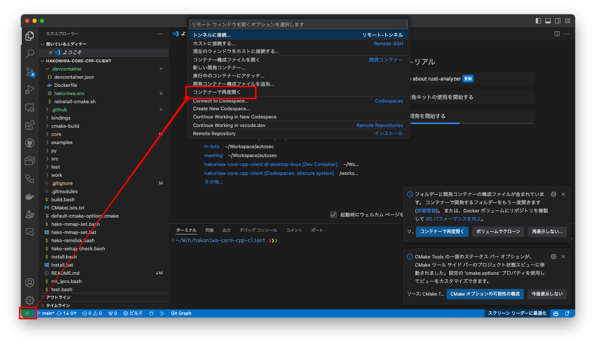

### リモートコンテナの終了
フォルダーを `ローカルで再度開く` をクリックするとコンテナへのリモート接続は終了します。
またリモートコンテナで作成性したファイルなどはそのままローカルで残ります。

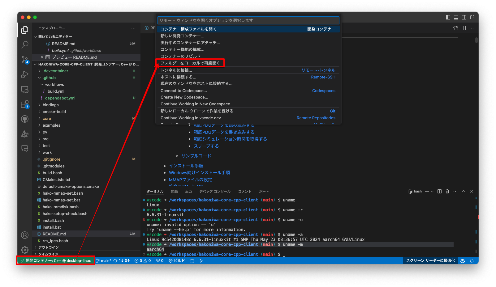

### 注意
* Applie Silicon Macをお使いの場合

コンテナーインスタンスのマシンアーキテクチャは `aarch64` になります。
```
vscode ➜ /workspaces/hakoniwa-core-cpp-client (main) $ uname -m
aarch64
```


